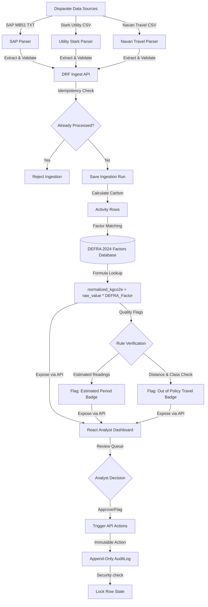

# 🍃 Breathe ESG: Carbon Accounting & Analyst Portal

Welcome to the **Breathe ESG Analyst Portal**! This is a complete production-grade carbon accounting system designed to parse, calculate, audit, and validate ESG activity data from disparate enterprise systems.

The platform provides automatic conversion of raw energy, material, and travel activities into carbon emissions ($kgCO_2e$) using the official **DEFRA 2024 Greenhouse Gas Conversion Factors**. It features an immutable audit logging layer to prevent double-counting or data tampering, a high-performance parsing architecture, and a premium glassmorphic React dashboard for ESG data analysts.

---

## 🏗️ System Architecture

The following diagram illustrates the end-to-end data flow: from ingestion of disparate files to automated carbon calculations, policy compliance screening, analyst data auditing, and final ledger state.



---

## ✨ Key Features

### 1. Robust Enterprise Parsers
- **SAP MM (MB51)**: Parses multi-line unstructured transactional text files containing material logs, extracts material types (e.g., Diesel B7, Petrol), dates, and quantities.
- **Stark HH Utility CSV**: Decodes raw half-hourly electricity meter reads, aggregates them, and flags overlaps or estimated intervals.
- **Navan Travel CSV**: Parses travel logs, automates class-of-travel policy checking, and maps travel modes to DEFRA factors.

### 2. Full Carbon Accounting Logic
- Seamlessly maps parsed activities to the corresponding **DEFRA 2024 Scope 1, 2, and 3 factors**.
- Computes $kgCO_2e$ dynamically based on parsed units (Liters, kWh, Passenger-Kilometers).
- Identifies quality exceptions (estimated periods, out-of-policy flights, missing factors) and flags them for analyst attention.

### 3. Immutable Security Audit Trail
- A strictly append-only `AuditLog` database model.
- Prevents modifications or deletions to logged audit records.
- Lock mechanism: Once an activity row is approved by an analyst, it is permanently locked to guarantee single-ledger accounting integrity.

### 4. Premium Glassmorphic React Dashboard
- **Ingestion Portal**: File dropzones with real-time feedback and dynamic tab navigation.
- **Runs History**: Overview of historical ingestion runs with transaction sizes, source types, and import times.
- **Review Queue**: Advanced filtering by status, source, and scope, with real-time Approve/Flag action drawers.
- **Audit Ledger**: A live, chronologically ordered, fully secure ledger showcasing actions taken by analysts.

---

## 🛠️ Technology Stack

- **Backend**: Django 4.2, Django REST Framework (DRF), PostgreSQL / SQLite.
- **Frontend**: React 18, Vite, Tailwind CSS, Axios.
- **Production Server**: Gunicorn (WSGI) + Nginx.
- **Containerization**: Docker & Docker Compose.

---

## 🚀 Local Quickstart

### Option A: Running with Docker Compose (Recommended)
Make sure you have Docker and Docker Compose installed.

1. **Spin up the stack**:
   ```bash
   docker-compose up --build
   ```
2. **Access the application**:
   - React Frontend: [http://localhost](http://localhost) (mapped on standard port 80)
   - Django Backend API: [http://localhost:8000](http://localhost:8000)
   - Django Admin: [http://localhost:8000/admin](http://localhost:8000/admin) (credentials: `admin` / `adminpassword` automatically seeded)

---

### Option B: Manual Setup

#### 1. Backend API (Django)
1. **Navigate to the root directory**:
   Create a virtual environment and activate it:
   ```bash
   python -m venv venv
   # On Windows:
   .\venv\Scripts\activate
   # On macOS/Linux:
   source venv/bin/activate
   ```
2. **Install dependencies**:
   ```bash
   pip install -r requirements.txt
   ```
3. **Configure Environment**:
   Copy `.env.example` to `.env` and fill out your variables if you wish to use PostgreSQL. If left blank, it will automatically fall back to SQLite.
4. **Run migrations and seed baseline DEFRA factors**:
   ```bash
   python manage.py migrate
   python manage.py seed_sample_data
   ```
5. **Start development server**:
   ```bash
   python manage.py runserver
   ```
   The backend API will listen on `http://localhost:8000`.

#### 2. Frontend Dashboard (React)
1. **Navigate to the frontend folder**:
   ```bash
   cd frontend
   ```
2. **Install node modules**:
   ```bash
   npm install
   ```
3. **Start development server**:
   ```bash
   npm run dev
   ```
   The React frontend will listen on `http://localhost:5173`.

---

## 🧪 Testing

We have built a suite of rigorous test cases to verify the parsers, carbon calculations, and API endpoints.

To run the backend test suite:
```bash
python manage.py test
```

---

## ☁️ Production Deployment

### 1. Deploying the Backend API
You can deploy the backend using container-based cloud providers (e.g., **Render**, **Railway**, **AWS ECS**, or **Heroku**):

- **Database**: Attach a managed PostgreSQL database.
- **Environment Variables**:
  - `DEBUG=False`
  - `SECRET_KEY=your-secure-random-key`
  - `ALLOWED_HOSTS=your-backend-app.render.com`
  - `DB_NAME`, `DB_USER`, `DB_PASSWORD`, `DB_HOST`, `DB_PORT` (populated by your managed PostgreSQL provider)
- **Deployment Command**:
  The provided `Dockerfile` will automatically handle migrations, seeding of DEFRA factors, and starting the `gunicorn` server.

### 2. Deploying the Frontend Dashboard
Vite compiles down to lightweight, static HTML, CSS, and JS. You can host it for free on high-performance CDN providers like **Vercel**, **Netlify**, or **GitHub Pages**:

- **Build settings**:
  - Build command: `npm run build`
  - Output directory: `dist`
- **Environment Variables**:
  - `VITE_API_URL`: `https://your-backend-app.render.com/api`
