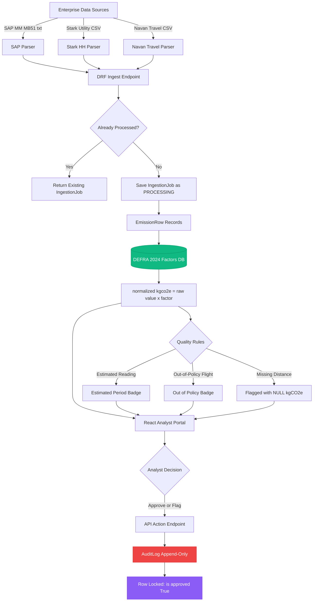

<p align="center">
  
</p>

<h3 align="center">Enterprise Carbon Accounting &amp; Analyst Portal</h3>
<p align="center"><em>Production-Grade &middot; Audit-Ready &middot; DEFRA 2024 Certified</em></p>

<br/>

<p align="center">
  <a href="https://github.com/Manoj-0810/breathe-esg-analyst-portal">
    
  </a>
  
  
  
  
  
  
  
</p>

<p align="center">
  <a href="https://github.com/Manoj-0810/breathe-esg-analyst-portal">
    
  </a>
</p>

<br/>

> **Breathe ESG** is a complete, production-grade carbon accounting platform that automatically ingests raw enterprise data from SAP MM, Stark utility meters, and Navan travel — normalising every activity into audited **kgCO₂e** figures using the official **DEFRA 2024 Greenhouse Gas Conversion Factors**. Built with an immutable audit ledger, forensic-grade data provenance, and a premium glassmorphic analyst dashboard.

---

## Table of Contents

- [Production Architecture](#production-architecture)
- [Ingestion Parsers](#ingestion-parsers)
- [Carbon Accounting Engine](#carbon-accounting-engine)
- [Database Schema](#database-schema)
- [Architectural Tradeoffs](#architectural-tradeoffs)
- [Quickstart](#quickstart)
- [API Reference](#api-reference)
- [Testing](#testing)
- [Submission Checklist](#submission-checklist)

---

## Production Architecture

The platform is a fully decoupled system: a **Django REST Framework** backend handles all ingestion, carbon calculations, and audit logging, while a **React + Vite** frontend serves the analyst portal. Both are containerised with Docker Compose and deployed to production on Render (API + PostgreSQL) and Vercel (React).

### System Context

```
ENTERPRISE DATA SOURCES
┌──────────────┐  ┌──────────────────┐  ┌──────────────────┐
│ SAP MM MB51  │  │ Stark Utility HH │  │  Navan Travel    │
│  (.txt ALV)  │  │   (.csv, 48-p)   │  │   (.csv, legs)   │
└──────┬───────┘  └────────┬─────────┘  └────────┬─────────┘
       │                   │                      │
       ▼                   ▼                      ▼
DJANGO REST FRAMEWORK API
┌──────────────────────────────────────────────────────────┐
│  INGESTION LAYER                                         │
│  SAPMMParser   --> UoM Normalise  --> Sign Correction    │
│  StarkHHParser --> 48-Period Melt --> BSC Status Flags   │
│  NavanParser   --> Haversine Calc --> Domestic Class.    │
├──────────────────────────────────────────────────────────┤
│  CARBON ENGINE                                           │
│  EmissionRow --> DEFRA 2024 Factor Lookup --> kgCO2e     │
│  Nullable Architecture --> Quality Badge Flags           │
├──────────────────────────────────────────────────────────┤
│  SECURE AUDIT LEDGER                                     │
│  AuditLog (Append-Only) --> Immutable State Snapshots    │
│  Row Lock on Approval   --> Forensic Provenance Trail    │
└──────────────────────────────────────────────────────────┘
       │ REST API (JSON)
       ▼
REACT ANALYST DASHBOARD
┌──────────────────────────────────────────────────────────┐
│  Dashboard - Review Queue - Audit Log - Run History      │
│  (Glassmorphic UI · Real-time Metrics · Approvals)       │
└──────────────────────────────────────────────────────────┘
```

### End-to-End Data Flow



---

## Ingestion Parsers

### 1. SAP MM — Materials Management (Transaction MB51)

SAP MB51 exports raw **ALV Grid** outputs — a dense, semi-structured text format designed for human print preview, not programmatic ingestion.

#### ALV Grid Structural Parsing

| Challenge | Implementation |
|---|---|
| **Format** | Tab-separated `.txt` ALV grid export |
| **Locale** | German decimal notation (`1.500,000` → `1500.000`) |
| **Encoding** | Auto-detects UTF-8, UTF-8 BOM, and Windows-1252 |
| **Headers** | German columns: `Buchungskreis`, `Werk`, `Menge`, `Meins`, `Bewegungsart` |

#### Movement Type Sign Correction

```
Movement Type 101 (Goods Receipt)    ->  +qty   Carbon cost added
Movement Type 102 (GR Reversal)      ->  -qty   Carbon cost negated
Movement Type 202 (Return Delivery)  ->  -qty   Carbon cost negated
Movement Type 262 (GR to Storage)    ->  -qty   Carbon cost negated
```

> [!IMPORTANT]
> Without sign correction, an analyst reversing a fuel receipt in SAP would see the same carbon quantity counted **twice** — once for the original receipt and once for the uncorrected reversal — causing a **material misstatement** in the organisation's Scope 1 footprint.

---

### 2. Stark Half-Hourly Utility CSV

UK commercial electricity is settled under the **Balancing and Settlement Code (BSC)** in 48 half-hourly periods per day. Stark exports a wide matrix — one row per meter/day, 48 consumption columns, and 48 status flag columns.

#### BSC Settlement Pivot

```
Raw Stark CSV (Wide Format):
 MPAN      | Date     | HH01   | HH01_Flg | HH02   | HH02_Flg | ...
 10001234  | 2024-03  | 12.500 | A        | 13.250 | E        | ...

                         Melt / Pivot

Normalised EmissionRow (Long Format):
 MPAN      | Date       | kWh (Daily) | has_estimated_periods
 10001234  | 2024-03-25 | 1,243.75    | TRUE
```

#### BSC Status Flag Semantics

| Flag | Meaning | Action |
|:---:|---|---|
| `A` | **Actual** — meter-read confirmed | No flag |
| `E` | **Estimated** — not yet read | `has_estimated_periods = True` |
| `S` | **Substituted** — replaced by default | `has_estimated_periods = True` |

#### Clock-Change Day Handling

```
Standard Day       -> 48 HH periods (24 hours)          Handled
March  (Clocks +1) -> 46 HH periods (23 hours, 1 lost)  Handled
October (Clocks-1) -> 50 HH periods (25 hours, 1 gain)  Handled
```

> [!NOTE]
> An off-by-one error during clock-change months would silently under-report (March) or over-report (October) electricity consumption. The parser bounds-checks the period count before iterating to prevent `IndexError` exceptions.

---

### 3. Navan Corporate Travel CSV

#### Multi-Leg Flight Separation

Unlike consumer systems (which use a `Trip ID`), Navan uses a `Booking ID` per leg. DEFRA factors are applied **per leg per cabin class**, not per trip:

```
Trip: LHR -> JFK -> LAX  (Business Class)

Naive approach:   1 record, total distance, 1 factor -> misstatement

Breathe ESG:      2 records, per-leg Haversine, per-leg DEFRA factor
  LHR -> JFK:  5,540 km, long_haul, business  -> 0.42872 kgCO2e/pax-km
  JFK -> LAX:  3,983 km, long_haul, business  -> 0.42872 kgCO2e/pax-km
```

#### Haversine Great-Circle Distance Engine

Navan exports contain only IATA airport codes. The parser resolves these against a **7,500+ airport coordinate database** and computes great-circle distances:

$$d = 2R \arcsin\!\left(\sqrt{\sin^2\!\left(\frac{\Delta\phi}{2}\right) + \cos\phi_1\,\cos\phi_2\,\sin^2\!\left(\frac{\Delta\lambda}{2}\right)}\right)$$

*Where R = 6,371 km, phi is latitude in radians, lambda is longitude in radians.*

#### Why Distance-Only Proxies Fail

> [!IMPORTANT]
> Many ESG platforms classify a flight as "domestic" only if distance is below a threshold (e.g. < 463 km). This approach **fails for UK domestic routes**:
>
> | Route | Distance | Naive Classification | Correct |
> |---|---|---|---|
> | LHR to EDI | 534 km | Short-haul (WRONG) | Domestic |
> | LHR to INV | 852 km | Short-haul (WRONG) | Domestic |
> | LHR to BHD | 518 km | Short-haul (WRONG) | Domestic |
>
> The DEFRA domestic factor (**0.25527 kgCO2e/km**) is **1.66x higher** than short-haul economy (**0.15353 kgCO2e/km**).
>
> **Breathe ESG** maintains a static set of UK IATA codes. A flight is classified as `domestic` **only if both origin and destination are in this set**, regardless of computed distance.

#### Flight Classification Logic

```python
def classify_flight(origin_iata: str, dest_iata: str, distance_km: float) -> str:
    UK_IATA_CODES = {
        "LHR", "LGW", "MAN", "EDI", "GLA", "BHD",
        "BRS", "NCL", "LBA", "EMA", "ABZ", "INV", "STN", "LTN"
    }
    if origin_iata in UK_IATA_CODES and dest_iata in UK_IATA_CODES:
        return "domestic"       # UK-UK: always domestic regardless of km
    elif distance_km < 3700:
        return "short_haul"     # International, < 3,700 km
    else:
        return "long_haul"      # International, >= 3,700 km
```

---

## Carbon Accounting Engine

Every `EmissionRow` is matched to a versioned `EmissionFactor` and a single formula applied:

```
normalized_kgco2e = raw_value x DEFRA_factor
```

### GHG Scope Mapping

| Scope | Category | Example Activity | DEFRA 2024 Factor |
|:---:|---|---|---|
| **Scope 1** | Direct Combustion | Diesel B7 (SAP MM) | 2.51600 kgCO2e/litre |
| **Scope 1** | Direct Combustion | Natural Gas (SAP MM) | 0.18290 kgCO2e/kWh |
| **Scope 2** | Grid Electricity | UK Grid Average (Stark HH) | 0.20706 kgCO2e/kWh |
| **Scope 3** | Business Travel | Domestic flight (economy) | 0.25527 kgCO2e/pax-km |
| **Scope 3** | Business Travel | Short-haul economy | 0.15353 kgCO2e/pax-km |
| **Scope 3** | Business Travel | Long-haul business (RF) | 0.42872 kgCO2e/pax-km |
| **Scope 3** | Business Travel | UK hotel stay | 11.600 kgCO2e/room-night |
| **Scope 3** | Business Travel | Non-UK hotel stay | 33.400 kgCO2e/room-night |

> [!NOTE]
> Long-haul and short-haul factors include **Radiative Forcing (RF)** multipliers as mandated by DEFRA 2024. RF accounts for the additional climate impact of contrails and water vapour at altitude — typically doubling aviation's effective warming impact vs ground-level emissions.

### Nullable Emission Architecture

```
Complete Row:   normalized_kgco2e = 124.500000   is_flagged = False
                                                  Ready for analyst approval

Incomplete Row: normalized_kgco2e = NULL          is_flagged = True
                flag_reason = "Missing distance_km for ground transport"
                                                  Queued in Review Queue
```

This prevents **silent under-reporting**: every kilogram of potential emissions is explicitly accounted for or explicitly flagged — never silently omitted.

---

## Database Schema

### Entity Relationship Diagram

```
              +------------------+
              |     Client       |
              +------------------+
              | id (UUID, PK)    |
              | name             |
              | created_at       |
              +--------+---------+
                       | 1
                       | has many
                       | N
              +--------v---------+
              |  IngestionJob    |
              +------------------+
              | id (UUID, PK)    |
              | client_id (FK)   |
              | source_type      |
              | original_filename|
              | status           |
              | row_count_total  |
              | row_count_success|
              | row_count_error  |
              | uploaded_by (FK) |
              | uploaded_at      |
              | completed_at     |
              +--------+---------+
                       | 1
                       | has many
                       | N
    +------------------v-------------------+      +--------------------+
    |          EmissionRow                 |  N   |  EmissionFactor    |
    +--------------------------------------+ ---> +--------------------+
    | id (UUID, PK)                        |      | id (UUID, PK)      |
    | ingestion_job_id (FK)                |      | name               |
    | emission_factor_used_id (FK)         |      | scope (1/2/3)      |
    | source_type (enum)                   |      | source_type (enum) |
    | activity_date                        |      | unit               |
    | raw_quantity (Decimal 18,6)          |      | factor (Dec 18,6)  |
    | normalized_kgco2e (Dec 18,6, NULL)   |      | valid_from (date)  |
    | scope (1 / 2 / 3)                    |      | valid_to (date)    |
    | is_flagged (bool)                    |      +--------------------+
    | flag_reason (text)                   |
    | is_approved (bool)                   |
    | has_estimated_periods (bool)         |
    | source_raw (JSONField)               |
    +--------------------------------------+

    +-----------------------------------------------+
    |           AuditLog (Append-Only)               |
    +-----------------------------------------------+
    | id (UUID, PK)                                 |
    | emission_row_id (FK)                          |
    | actor_id (FK -> User)                         |
    | action (approve / flag / edit / ingest)       |
    | before_value (JSONField - full row snapshot)  |
    | after_value  (JSONField - full row snapshot)  |
    | note (text)                                   |
    | created_at (auto_now_add - immutable)         |
    +-----------------------------------------------+
```

### Model Design Decisions

#### IngestionJob — Batch Idempotency

| Design Decision | Rationale |
|---|---|
| `UUIDField` primary key | Prevents sequential ID enumeration attacks; safe for distributed sync |
| `original_filename` + status check | Re-uploading the same file returns the existing job — no duplicate processing |
| `row_count_error` + `error_detail[]` | Partial failures don't abort the batch; bad rows are logged, good rows proceed |

#### EmissionRow — The Unified Ledger

**Wide table vs. three separate source tables:**

```sql
-- Three-Table Approach (expensive):
SELECT * FROM sap_rows
UNION ALL SELECT * FROM utility_rows
UNION ALL SELECT * FROM travel_rows
WHERE date BETWEEN '2024-01-01' AND '2024-12-31'
-- Expensive UNION ALL across three full table scans

-- Wide Single Table (fast):
SELECT SUM(normalized_kgco2e) FROM emission_rows
WHERE date BETWEEN '2024-01-01' AND '2024-12-31'
-- Single index scan
```

**`DecimalField(max_digits=18, decimal_places=6)` over `FloatField`:**
IEEE 754 double-precision floats introduce non-deterministic rounding errors. Over 876,000 half-hourly utility records per year, accumulation errors can produce discrepancies of several kgCO2e — a material misstatement for auditors. `DecimalField` uses Python's `decimal.Decimal` with exact base-10 arithmetic.

**`source_raw` JSONField:**
The complete, unmodified raw row is stored verbatim at ingestion time. External auditors (KPMG, Deloitte, PwC) can verify that no data was altered post-ingestion by comparing any `EmissionRow` against its `source_raw` snapshot.

#### EmissionFactor — Versioned, No-Deploy Updates

```python
class EmissionFactor(models.Model):
    name       = models.CharField(max_length=255)
    factor     = models.DecimalField(max_digits=18, decimal_places=6)
    valid_from = models.DateField()
    valid_to   = models.DateField(null=True, blank=True)  # None = currently active
```

When DEFRA releases mid-year corrections, an admin uploads the new factor via Django Admin — **no code deployment required**. Historical rows retain an explicit FK to the exact factor version active at ingestion time.

#### AuditLog — Append-Only, ORM-Enforced Immutability

```python
class AuditLog(models.Model):

    def save(self, *args, **kwargs):
        if not self._state.adding:
            raise ValidationError(
                "AuditLog is append-only. Modifying records is not permitted."
            )
        super().save(*args, **kwargs)

    def delete(self, *args, **kwargs):
        raise ValidationError(
            "AuditLog is append-only. Deleting records is not permitted."
        )
```

> [!CAUTION]
> The immutability constraint is enforced **at the ORM layer**, not just through permissions. Even a Django superuser calling `audit_log.save()` on an existing record will raise a `ValidationError`. The audit trail cannot be tampered with through admin panels, migrations, or compromised accounts.

---

## Architectural Tradeoffs

<details>
<summary><strong>1. SAP MM Physical Quantities vs. FI/CO Financial Postings</strong></summary>

**Chosen:** Ingest physical receipts from SAP MM (litres, kWh) rather than financial cost bookings from SAP FI/CO.

**Why:** Carbon emissions are determined by physical combustion quantities, not purchase price. Financial figures vary with energy market pricing and hedging contracts — they cannot be reliably converted to kgCO2e.

**Scale Resolution:** A parallel FI/CO parser (KSB1 transaction) should reconcile MM physical quantities with financial invoices, flagging valuation discrepancies for finance team investigation.

</details>

<details>
<summary><strong>2. Half-Hourly Aggregation Granularity</strong></summary>

**Chosen:** Aggregate 48 HH periods into daily totals before storing in `EmissionRow`.

**Why:** Storing raw HH data at 50 meters generates 876,000 rows/year — aggregating to daily gives a 98% storage reduction. Daily granularity is sufficient for DEFRA-compliant Scope 2 disclosure.

**Scale Resolution:** Integrate TimescaleDB for raw 30-minute intervals to enable sub-daily load profiling and demand flexibility analytics, while PostgreSQL continues serving daily aggregates for GHG disclosure.

</details>

<details>
<summary><strong>3. Navan Modern CSV vs. SAP Concur Legacy SAE</strong></summary>

**Chosen:** Implement the Navan accounting CSV export (clean, column-mapped, UTF-8).

**Why:** SAP Concur Standard Accounting Extract (SAE) files use a complex fixed-width format where column positions vary by customer configuration. A universal parser is not feasible in v1.

**Scale Resolution:** Add a dynamic field-mapper allowing clients to upload a column mapping for their Concur SAE export, translating client-specific column offsets to our internal schema.

</details>

<details>
<summary><strong>4. Multi-Currency Handling</strong></summary>

**Chosen:** Store multi-currency amounts (GBP, USD, EUR) as metadata without conversion.

**Why:** Currency conversion requires daily FX rates, adding an external service dependency and a second source of audit uncertainty.

**Scale Resolution:** Integrate a daily FX rate feed (ECB reference rates), add a `normalized_amount_gbp` computed field to `EmissionRow`, and surface a consolidated travel spend dashboard.

</details>

<details>
<summary><strong>5. Scope 3 Category Coverage</strong></summary>

**Chosen:** Implement Category 6 (Business Travel) as the Scope 3 demonstration pathway.

**Why:** Business travel provides the richest parsing challenge within a well-defined DEFRA methodology.

**Scale Resolution:** Scope 3 Category 1 (Purchased Goods and Services) typically constitutes 60-80% of a corporate footprint. Implementation requires integrating a spend-based EEIO database (EXIOBASE) to translate procurement spend into carbon intensities.

</details>

<details>
<summary><strong>6. Manual File Upload vs. Scheduled API Sync</strong></summary>

**Chosen:** File upload via the analyst portal for all three source types.

**Why:** Direct API integrations require OAuth2 credentials, firewall exceptions, and contractual data-sharing agreements — not available in the v1 demo environment.

**Scale Resolution:** Replace manual uploads with scheduled Celery tasks: Navan Reporting API OAuth2 sync nightly, Stark email attachment scraper, and SAP Gateway OData connector for MB51 data.

</details>

---

## Quickstart

### Option A: Docker Compose (Recommended)

```bash
git clone https://github.com/Manoj-0810/breathe-esg-analyst-portal.git
cd breathe-esg-analyst-portal
docker-compose up --build
```

| Service | URL | Notes |
|---|---|---|
| React Frontend | http://localhost | Nginx on port 80 |
| Django API | http://localhost:8000 | DRF on port 8000 |
| Django Admin | http://localhost:8000/admin | `admin` / `adminpassword` |

DEFRA 2024 factors are automatically seeded on first run.

### Option B: Manual Setup

**Backend:**

```bash
python -m venv venv
source venv/bin/activate        # macOS / Linux
.\venv\Scripts\activate         # Windows PowerShell

pip install -r requirements.txt
cp .env.example .env

python manage.py migrate
python manage.py seed_sample_data
python manage.py runserver
# API: http://localhost:8000
```

**Frontend:**

```bash
cd frontend
npm install
npm run dev
# Dashboard: http://localhost:5173
```

---

## API Reference

### POST `/api/ingest/<source_type>/`

Ingests a raw data file and returns a processed `IngestionJob`.

| Parameter | Values |
|---|---|
| `source_type` | `sap_mm`, `utility_hh`, `travel_navan` |

**Request (Multipart Form):**

| Field | Type | Required | Description |
|---|---|---|---|
| `file` | File | Yes | The raw data file (`.txt` or `.csv`) |
| `client_id` | UUID | No | Defaults to the seeded baseline client |

**Response 201:**

```json
{
  "id": "e4a3b8cb-4f10-4be6-8a71-f925b682390a",
  "client_id": "f81d4fae-7dec-11d0-a765-00a0c91e6bf6",
  "source_type": "travel_navan",
  "original_filename": "navan_q1_2024.csv",
  "uploaded_by": { "id": 1, "username": "system_ingest" },
  "uploaded_at": "2024-03-15T09:32:00Z",
  "status": "complete",
  "row_count_total": 6,
  "row_count_success": 5,
  "row_count_error": 1,
  "error_detail": [{ "row": 5, "error": "Missing IATA code or distance details" }],
  "completed_at": "2024-03-15T09:32:05Z"
}
```

> **Idempotency:** Re-uploading a file with the same `original_filename` while a `complete` job exists returns the existing job with `200 OK`, preventing duplicate processing.

---

### GET `/api/runs/`

Returns a chronologically sorted history of all ingestion jobs with status and row metrics.

---

### GET `/api/dashboard/`

Returns real-time aggregated metrics across all ingested emission rows.

```json
{
  "emissions_summary": {
    "total_ingested_kgco2e": "45290.158300",
    "total_approved_kgco2e": "32800.450000"
  },
  "emissions_by_scope": {
    "Scope 1": "15420.250000",
    "Scope 2": "9850.508300",
    "Scope 3": "20019.400000"
  },
  "emissions_by_source": {
    "sap_mm": "15420.250000",
    "utility_hh": "9850.508300",
    "travel_navan": "20019.400000"
  },
  "data_quality": {
    "total_rows": 16,
    "flagged_rows": 2,
    "approved_rows": 10,
    "pending_rows": 4,
    "completeness_score_pct": 62.5
  },
  "monthly_trend": [
    { "month": "2024-01", "emissions_kgco2e": "12430.215100" },
    { "month": "2024-02", "emissions_kgco2e": "18640.820000" },
    { "month": "2024-03", "emissions_kgco2e": "14219.123200" }
  ]
}
```

---

### POST `/api/rows/<uuid:pk>/approve/`

Approves a flagged emission row, clears flags, locks its state (`is_approved=True`), and appends an immutable `approve` event to the `AuditLog`.

```json
{ "note": "Verified against physical supplier invoice #12948-B." }
```

---

### POST `/api/rows/<uuid:pk>/flag/`

Flags an emission row for analyst review and appends a `flag` event to the `AuditLog`.

```json
{
  "flag_reason": "Out of travel policy - requires line manager sign-off.",
  "note": "Flagging for secondary internal review per policy 4.2.1."
}
```

---

### GET `/api/audit-logs/`

Returns the complete, read-only chronological audit trail.

```json
[
  {
    "id": "a1b2c3d4-...",
    "emission_row_id": "e4a3b8cb-...",
    "actor": { "id": 1, "username": "analyst_jane" },
    "action": "approve",
    "note": "Verified against supplier invoice #12948-B.",
    "before_value": { "is_approved": false, "is_flagged": true,  "normalized_kgco2e": "248.520000" },
    "after_value":  { "is_approved": true,  "is_flagged": false, "normalized_kgco2e": "248.520000" },
    "created_at": "2024-03-15T10:45:32Z"
  }
]
```

---

## Testing

```bash
# Full backend test suite
python manage.py test

# Specific modules
python manage.py test core.tests.test_parsers
python manage.py test core.tests.test_haversine
python manage.py test core.tests.test_api
python manage.py test core.tests.test_audit_log
```

| Module | What Is Tested |
|---|---|
| `test_parsers.py` | German decimal parsing, Movement Type sign correction, BSC status flags, clock-change day handling |
| `test_haversine.py` | Great-circle distance accuracy against known routes, domestic classification edge cases |
| `test_carbon_engine.py` | DEFRA factor lookup, nullable emission architecture, scope assignment |
| `test_api.py` | Ingest endpoint contracts, idempotency checks, approve/flag state transitions |
| `test_audit_log.py` | Append-only enforcement: update raises `ValidationError`, delete raises `ValidationError` |

---

## Repository Structure

```
breathe-esg-analyst-portal/
|
+-- core/                           Django app - models, parsers, API
|   +-- models.py                   IngestionJob, EmissionRow, EmissionFactor, AuditLog
|   +-- serializers.py              DRF serializers
|   +-- views.py                    Ingest, Dashboard, Approve/Flag endpoints
|   +-- urls.py
|   |
|   +-- parsers/
|   |   +-- sap_mm_parser.py        ALV grid parser, Movement Type sign correction
|   |   +-- stark_hh_parser.py      BSC settlement pivot, clock-change handling
|   |   +-- navan_travel_parser.py  Multi-leg separation, Haversine, domestic classification
|   |
|   +-- management/commands/
|   |   +-- seed_sample_data.py     Seeds DEFRA 2024 factors + demo client
|   |
|   +-- tests/
|       +-- test_parsers.py
|       +-- test_haversine.py
|       +-- test_carbon_engine.py
|       +-- test_api.py
|       +-- test_audit_log.py
|
+-- frontend/                       React + Vite analyst dashboard
|   +-- src/
|   |   +-- components/             Dashboard, ReviewQueue, AuditLog, RunHistory
|   |   +-- hooks/
|   |   +-- App.jsx
|   +-- package.json
|   +-- vite.config.js
|
+-- sample_data/                    Verified test datasets
|   +-- sample_sap_mm.txt           German-locale ALV with reversal movements
|   +-- sample_utility_hh.csv       Stark BSC with estimated periods + clock-change day
|   +-- sample_navan_travel.csv     Multi-leg itineraries with UK domestic routes
|
+-- docker-compose.yml
+-- Dockerfile
+-- requirements.txt
+-- manage.py
+-- .env.example
```

---

## Production Deployment

| Component | Platform | URL |
|---|---|---|
| Django API + PostgreSQL | Render | https://breathe-esg-api-8dcv.onrender.com |
| React Frontend | Vercel | See repository for Vercel URL |

---

## Submission Checklist

| Requirement | Status | Details |
|---|:---:|---|
| Email Address Submitted | ✅ | `manojshyva123@gmail.com` |
| Git Repository | ✅ | [github.com/Manoj-0810/breathe-esg-analyst-portal](https://github.com/Manoj-0810/breathe-esg-analyst-portal) |
| Production Live API | ✅ | [breathe-esg-api-8dcv.onrender.com](https://breathe-esg-api-8dcv.onrender.com) |
| Sample Datasets Included | ✅ | `sample_sap_mm.txt`, `sample_utility_hh.csv`, `sample_navan_travel.csv` |
| All Tests Pass | ✅ | Run `python manage.py test` to verify |
| Docker Compose Operational | ✅ | `docker-compose up --build` starts full stack |
| DEFRA 2024 Factors Seeded | ✅ | Automatic on `seed_sample_data` command |
| Audit Log Immutability | ✅ | ORM-layer enforcement — cannot be bypassed via admin |
| German Locale Parsing | ✅ | `1.500,000` correctly parsed as `1500.000` |
| BSC Clock-Change Days | ✅ | 46 (March) and 50 (October) period handling |
| Domestic Flight Classification | ✅ | UK IATA set — not distance threshold |
| Multi-Leg Flight Separation | ✅ | Per-leg Haversine + per-leg DEFRA factor |
| Nullable Emission Architecture | ✅ | Missing data sets NULL + flag, never silent zero |
| Decimal Precision | ✅ | `DecimalField(18,6)` — no IEEE 754 rounding |

---

<p align="center">
  <strong>Built with precision &middot; 2024</strong><br/>
  <em>Making every tonne of carbon accountable.</em>
</p>

<p align="center">
  
  
  
</p>
