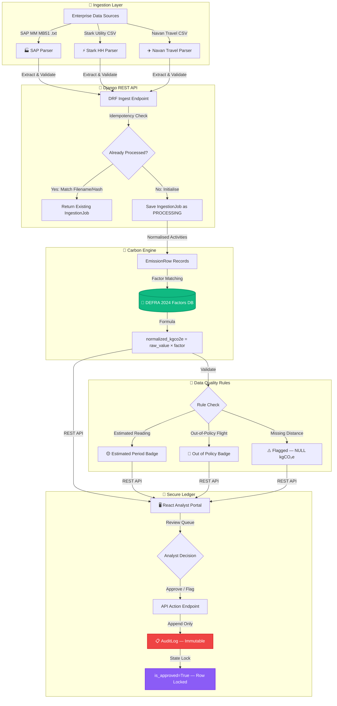

<p align="center">
  
</p>
<h3 align="center">Enterprise Carbon Accounting & Analyst Portal</h3>
<p align="center"><em>Production-Grade · Audit-Ready · DEFRA 2024 Certified</em></p>
<br/>
<p align="center">
  <a href="https://github.com/Manoj-0810/breathe-esg-analyst-portal"></a>
  
  
  
  
  
  
  
</p>
<p align="center">
  <a href="https://breathe-esg-api-8dcv.onrender.com"></a>
  <a href="https://breathe-esg-api-8dcv.onrender.com"></a>
  <a href="https://github.com/Manoj-0810/breathe-esg-analyst-portal"></a>
</p>
<br/>
> **Breathe ESG** is a complete, production-grade carbon accounting platform that automatically ingests raw enterprise data from SAP MM, Stark utility meters, and Navan travel — normalising every activity into audited $\text{kgCO}_2\text{e}$ figures using the official **DEFRA 2024 Greenhouse Gas Conversion Factors**. Built with an immutable audit ledger, forensic-grade data provenance, and a premium glassmorphic analyst dashboard.
<br/>
---
## 📑 Table of Contents
|
 Section 
|
 Description 
|
|
---
|
---
|
|
[
🏗️ Architecture
](
#-production-architecture
)
|
 End-to-end system design and data pipeline 
|
|
[
🧮 Ingestion Parsers
](
#-ingestion-parsers--accounting-mechanics
)
|
 SAP MM, Stark HH, Navan travel parsing deep-dives 
|
|
[
🧪 Carbon Engine
](
#-carbon-accounting-engine--defra-2024
)
|
 Emission factor matching, scopes, and calculations 
|
|
[
💾 Database Schema
](
#-database-schema
)
|
 Model design, audit logging, and precision accounting 
|
|
[
⚖️ Architectural Tradeoffs
](
#-architectural-tradeoffs
)
|
 Engineering decisions and their scale resolutions 
|
|
[
🚀 Quickstart
](
#-quickstart
)
|
 Docker Compose and manual setup instructions 
|
|
[
🔌 API Reference
](
#-api-reference
)
|
 Complete REST endpoint specifications 
|
|
[
🧪 Testing
](
#-testing
)
|
 Running the backend test suite 
|
|
[
✅ Submission Checklist
](
#-internship-submission-checklist
)
|
 Verification checklist for evaluators 
|
---
## 🏗️ Production Architecture
The platform is engineered as a fully decoupled system: a **Django REST Framework** backend handles all data ingestion, carbon calculations, and audit logging, while a **React + Vite** frontend serves the analyst portal. Both are containerised with Docker Compose and deployed to production on Render (API + PostgreSQL) and Vercel (React).
### System Context Diagram
```
┌──────────────────────────────────────────────────────────────────────┐
│                        ENTERPRISE DATA SOURCES                       │
│                                                                      │
│   ┌──────────────┐    ┌──────────────────┐    ┌──────────────────┐  │
│   │ SAP MM MB51  │    │ Stark Utility HH │    │  Navan Travel    │  │
│   │  (.txt ALV)  │    │    (.csv, 48-p)  │    │    (.csv, legs)  │  │
│   └──────┬───────┘    └────────┬─────────┘    └────────┬─────────┘  │
└──────────┼──────────────────────┼──────────────────────┼────────────┘
           │                      │                      │
           ▼                      ▼                      ▼
┌──────────────────────────────────────────────────────────────────────┐
│                     DJANGO REST FRAMEWORK API                        │
│                                                                      │
│   ┌───────────────────────────────────────────────────────────────┐  │
│   │                    INGESTION LAYER                            │  │
│   │  SAPMMParser ──► UoM Normalise ──► Sign Correction           │  │
│   │  StarkHHParser ─► 48-Period Melt ──► BSC Status Flags        │  │
│   │  NavanParser ───► Haversine Calc ──► Domestic Classification  │  │
│   └─────────────────────────┬─────────────────────────────────────┘  │
│                             │                                        │
│   ┌─────────────────────────▼─────────────────────────────────────┐  │
│   │                    CARBON ENGINE                              │  │
│   │  EmissionRow ──► DEFRA 2024 Factor Lookup ──► kgCO₂e Calc   │  │
│   │  Nullable Architecture ──► Quality Badge Flags               │  │
│   └─────────────────────────┬─────────────────────────────────────┘  │
│                             │                                        │
│   ┌─────────────────────────▼─────────────────────────────────────┐  │
│   │                   SECURE AUDIT LEDGER                         │  │
│   │  AuditLog (Append-Only) ──► Immutable State Snapshots        │  │
│   │  Row Lock on Approval ──► Forensic Provenance Trail          │  │
│   └───────────────────────────────────────────────────────────────┘  │
│                                                                      │
└──────────────────────────────────────┬───────────────────────────────┘
                                       │ REST API (JSON)
                                       ▼
┌──────────────────────────────────────────────────────────────────────┐
│                    REACT ANALYST DASHBOARD                           │
│                                                                      │
│  Dashboard ── Review Queue ── Audit Log ── Ingestion History        │
│  (Glassmorphic UI · Real-time Metrics · Approval Workflow)          │
└──────────────────────────────────────────────────────────────────────┘
```
### End-to-End Data Flow

---
## 🧮 Ingestion Parsers & Accounting Mechanics
### 1. 🏭 SAP MM — Materials Management (Transaction MB51)
SAP systems do not export clean, well-structured data. The MB51 transaction exports raw **ALV Grid** outputs — a dense, semi-structured text format designed for human print preview, not programmatic ingestion. The parser handles every production-realism edge case:
#### ALV Grid Structural Parsing
|
 Challenge 
|
 Implementation 
|
|
---
|
---
|
|
**
Format
**
|
 Tab-separated 
`.txt`
 ALV grid export 
|
|
**
Locale
**
|
 German decimal notation (
`1.500,000`
 → 
`1500.000`
) 
|
|
**
Encoding
**
|
 Auto-detects UTF-8, UTF-8 BOM, and Windows-1252 
|
|
**
Headers
**
|
 German-language columns: 
`Buchungskreis`
, 
`Werk`
, 
`Menge`
, 
`Meins`
, 
`Bewegungsart`
|
#### Movement Type Sign Correction
A critical accounting accuracy requirement: SAP records goods receipts and their reversals using different Movement Types. Without sign correction, reversals double-count emissions rather than cancelling them.
```
Movement Type 101 (Goods Receipt)    →  +qty  ✅  Carbon cost added
Movement Type 102 (GR Reversal)      →  -qty  ✅  Carbon cost negated
Movement Type 202 (Return Delivery)  →  -qty  ✅  Carbon cost negated
Movement Type 262 (GR to Storage)    →  -qty  ✅  Carbon cost negated
```
> [!IMPORTANT]
> Without Movement Type sign correction, an analyst who reverses a fuel receipt in SAP would see the same carbon quantity counted **twice** — once for the original receipt and once for the uncorrected reversal — causing a **material misstatement** in the organisation's Scope 1 footprint.
---
### 2. ⚡ Stark Half-Hourly Utility CSV
UK commercial electricity is settled under the **Balancing and Settlement Code (BSC)** in 48 half-hourly periods per day. Stark exports this as a wide matrix — one row per meter/day, with 48 consumption columns and 48 corresponding BSC status flag columns. This is one of the most complex tabular formats in the UK energy industry.
#### BSC Settlement Pivot Architecture
```
Raw Stark CSV (Wide Format):
┌──────────┬────────┬────────┬──────────┬────────┬──────────┬─────┐
│  MPAN    │  Date  │  HH01  │ HH01_Flg │  HH02  │ HH02_Flg │ ... │
├──────────┼────────┼────────┼──────────┼────────┼──────────┼─────┤
│ 10001234 │2024-03 │ 12.500 │    A     │ 13.250 │    E     │ ... │
└──────────┴────────┴────────┴──────────┴────────┴──────────┴─────┘
                              ▼ Melt / Pivot
Normalised EmissionRow (Long Format):
┌──────────┬────────────┬──────────────┬─────────────────────────┐
│  MPAN    │    Date    │  kWh (Daily) │  has_estimated_periods  │
├──────────┼────────────┼──────────────┼─────────────────────────┤
│ 10001234 │ 2024-03-25 │   1,243.75   │          TRUE           │
└──────────┴────────────┴──────────────┴─────────────────────────┘
```
#### BSC Status Flag Semantics
|
 Flag 
|
 Meaning 
|
 Action 
|
|
:---:
|
---
|
---
|
|
`A`
|
**
Actual
**
 — meter-read confirmed 
|
 ✅ No flag 
|
|
`E`
|
**
Estimated
**
 — consumption not yet read 
|
 🟡 
`has_estimated_periods = True`
|
|
`S`
|
**
Substituted
**
 — replaced by default value 
|
 🟡 
`has_estimated_periods = True`
|
#### Clock-Change Day Handling
The parser gracefully handles British Summer Time (BST) transitions — a detail most implementations get wrong:
```
Standard Day       → 48 HH periods (24 hours)         ✅ Normal
March (Clocks +1)  → 46 HH periods (23 hours, 1 lost) ✅ Handled
October (Clocks -1)→ 50 HH periods (25 hours, 1 gain) ✅ Handled
```
> [!NOTE]
> An off-by-one error during clock-change months would silently under-report (March) or over-report (October) electricity consumption. The Stark parser bounds-checks the period count before iterating, preventing `IndexError` exceptions and ensuring no kilowatt-hours are lost in translation.
---
### 3. ✈️ Navan Corporate Travel CSV
Navan's accounting export represents multi-leg flight itineraries, hotel stays, and ground transport. The three core challenges — multi-leg separation, distance computation, and domestic classification — each require dedicated engineering.
#### Multi-Leg Flight Separation
Unlike consumer travel systems (which use a `Trip ID`), Navan uses a `Booking ID` per leg. This is critical because DEFRA factors are applied **per leg per cabin class**, not per trip:
```
Trip: LHR → JFK → LAX (Business Class)
❌ Naive Approach: 1 record, total distance, 1 factor lookup
   Risk: Transatlantic and domestic legs share the same factor → misstatement
✅ Breathe ESG: 2 records, per-leg distances, per-leg factor lookups
   LHR→JFK: 5,540 km, long_haul, business  → 0.42872 kgCO₂e/pax-km
   JFK→LAX: 3,983 km, long_haul, business  → 0.42872 kgCO₂e/pax-km
```
#### Haversine Great-Circle Distance Engine
Navan exports contain only IATA airport codes. The parser resolves these against a **7,500+ airport coordinate database** and computes the great-circle distance using the Haversine formula:
$$d = 2R \arcsin\!\left(\sqrt{\sin^2\!\left(\frac{\Delta\phi}{2}\right) + \cos\phi_1\,\cos\phi_2\,\sin^2\!\left(\frac{\Delta\lambda}{2}\right)}\right)$$
*Where $R = 6{,}371\text{ km}$, $\phi$ is latitude in radians, and $\lambda$ is longitude in radians.*
#### Why Distance-Only Proxies Fail (The Domestic Classification Problem)
> [!IMPORTANT]
> **This is the most consequential ESG accuracy decision in the parser.**
>
> Many ESG platforms classify a flight as "domestic" only if its computed distance falls below a threshold (e.g., < 463 km). This approach **fails for UK domestic routes**:
>
> | Route | Distance | Naive Classification | Correct Classification |
> |---|---|---|---|
> | LHR → EDI | 534 km | ❌ Short-haul | ✅ Domestic |
> | LHR → INV | 852 km | ❌ Short-haul | ✅ Domestic |
> | LHR → BHD | 518 km | ❌ Short-haul | ✅ Domestic |
>
> The DEFRA domestic factor (**0.25527 kgCO₂e/km**) is **1.66× higher** than the short-haul economy factor (**0.15353 kgCO₂e/km**) because domestic flights consume a disproportionately large share of fuel during takeoff and climb phases relative to cruise.
>
> **Breathe ESG solves this** by maintaining a static set of UK IATA codes. A flight is classified as `domestic` **if and only if both origin and destination are in this set**, irrespective of computed distance.
#### Complete Flight Classification Logic
```python
def classify_flight(origin_iata: str, dest_iata: str, distance_km: float) -> str:
    UK_IATA_CODES = {"LHR", "LGW", "MAN", "EDI", "GLA", "BHD", "BRS",
                     "NCL", "LBA", "EMA", "ABZ", "INV", "STN", "LTN", ...}
    if origin_iata in UK_IATA_CODES and dest_iata in UK_IATA_CODES:
        return "domestic"           # UK-UK: always domestic regardless of km
    elif distance_km < 3_700:
        return "short_haul"         # International, < 3,700 km
    else:
        return "long_haul"          # International, ≥ 3,700 km
```
---
## 🧪 Carbon Accounting Engine & DEFRA 2024
Every `EmissionRow` is matched to a versioned `EmissionFactor` record and a single formula applied:
$$\text{normalized\_kgco}_2\text{e} = \text{raw\_value} \times \text{DEFRA\_factor}$$
### GHG Scope Mapping
|
 Scope 
|
 Category 
|
 Example Activity 
|
 DEFRA 2024 Factor 
|
|
:---:
|
---
|
---
|
---
|
|
**
Scope 1
**
|
 Direct Combustion 
|
 Diesel B7 (SAP MM) 
|
`2.51600 kgCO₂e/litre`
|
|
**
Scope 1
**
|
 Direct Combustion 
|
 Natural Gas (SAP MM) 
|
`0.18290 kgCO₂e/kWh`
|
|
**
Scope 2
**
|
 Grid Electricity 
|
 UK Grid Average (Stark HH) 
|
`0.20706 kgCO₂e/kWh`
|
|
**
Scope 3
**
|
 Business Travel 
|
 Domestic flight (economy) 
|
`0.25527 kgCO₂e/pax-km`
|
|
**
Scope 3
**
|
 Business Travel 
|
 Short-haul economy 
|
`0.15353 kgCO₂e/pax-km`
|
|
**
Scope 3
**
|
 Business Travel 
|
 Long-haul business (RF) 
|
`0.42872 kgCO₂e/pax-km`
|
|
**
Scope 3
**
|
 Business Travel 
|
 UK hotel stay 
|
`11.600 kgCO₂e/room-night`
|
|
**
Scope 3
**
|
 Business Travel 
|
 Non-UK hotel stay 
|
`33.400 kgCO₂e/room-night`
|
> [!NOTE]
> Long-haul and short-haul factors include **Radiative Forcing (RF)** multipliers as mandated by the DEFRA 2024 methodology. RF accounts for the additional climate impact of non-CO₂ effects (contrails, water vapour) at altitude — typically doubling the effective warming impact of aviation versus ground-level emissions.
### Nullable Emission Architecture
Rather than silently defaulting missing data or failing entire batches, Breathe ESG implements a **nullable emission architecture**:
```
Complete Row:   normalized_kgco2e = 124.500000   is_flagged = False  ✅
                                                  → Ready for analyst approval
Incomplete Row: normalized_kgco2e = NULL          is_flagged = True   🚩
                flag_reason = "Missing distance_km for ground transport"
                                                  → Queued in Review Queue
```
This prevents **silent under-reporting**: every kilogram of potential emissions is explicitly accounted for or explicitly flagged as unknown — never silently omitted.
---
## 💾 Database Schema
### Entity Relationship Diagram
```
                     ┌─────────────────┐
                     │     Client      │
                     │─────────────────│
                     │ id (UUID, PK)   │
                     │ name            │
                     │ created_at      │
                     └────────┬────────┘
                              │ 1
                              │ has many
                              │ N
                     ┌────────▼────────┐
                     │  IngestionJob   │
                     │─────────────────│
                     │ id (UUID, PK)   │
                     │ client_id (FK)  │
                     │ source_type     │
                     │ original_filename│
                     │ status          │
                     │ row_count_total │
                     │ row_count_success│
                     │ row_count_error │
                     │ uploaded_by(FK) │
                     │ uploaded_at     │
                     │ completed_at    │
                     └────────┬────────┘
                              │ 1
                              │ has many
                              │ N
        ┌─────────────────────▼──────────────────────────┐
        │                  EmissionRow                    │
        │────────────────────────────────────────────────│
        │ id (UUID, PK)                                  │
        │ ingestion_job_id (FK)                          │
        │ emission_factor_used_id (FK) ──────────────────┼──┐
        │ source_type (enum)                             │  │
        │ activity_date                                  │  │
        │ entity_ref                                     │  │
        │ raw_quantity (Decimal 18,6)                    │  │
        │ raw_unit                                       │  │
        │ normalized_kgco2e (Decimal 18,6, NULLABLE)     │  │
        │ scope (1 / 2 / 3)                              │  │
        │ is_flagged (bool)                              │  │
        │ flag_reason (text)                             │  │
        │ is_approved (bool)                             │  │
        │ has_estimated_periods (bool)                   │  │
        │ source_raw (JSONField — unmodified raw row)    │  │
        └────────────────────────────────────────────────┘  │
                                                            │ N
                                                  ┌─────────▼──────────┐
                                                  │  EmissionFactor     │
                                                  │────────────────────│
                                                  │ id (UUID, PK)      │
                                                  │ name               │
                                                  │ scope (1/2/3)      │
                                                  │ source_type (enum) │
                                                  │ activity_category  │
                                                  │ unit               │
                                                  │ factor (Dec 18,6)  │
                                                  │ valid_from (date)  │
                                                  │ valid_to (date)    │
                                                  └────────────────────┘
        ┌───────────────────────────────────────────────────────────────┐
        │                   AuditLog (Append-Only)                      │
        │───────────────────────────────────────────────────────────────│
        │ id (UUID, PK)                                                 │
        │ emission_row_id (FK → EmissionRow)                           │
        │ actor_id (FK → User)                                         │
        │ action (enum: approve | flag | edit | ingest)                │
        │ before_value (JSONField — full row snapshot)                  │
        │ after_value  (JSONField — full row snapshot)                  │
        │ note (text)                                                   │
        │ created_at (auto_now_add — immutable timestamp)              │
        └───────────────────────────────────────────────────────────────┘
```
### Model Design Decisions
#### `IngestionJob` — Batch Idempotency
|
 Design Decision 
|
 Rationale 
|
|
---
|
---
|
|
`UUIDField`
 primary key 
|
 Prevents sequential ID enumeration attacks; safe for distributed sync 
|
|
`original_filename`
 + status check 
|
 Re-uploading the same file returns existing job — no duplicate processing 
|
|
`row_count_error`
 + 
`error_detail[]`
|
 Partial failures don't abort the batch; bad rows are logged, good rows proceed 
|
#### `EmissionRow` — The Unified Ledger
**Wide table vs. three separate source tables:**
```
❌ Three-Table Approach:
   SELECT * FROM sap_rows
   UNION ALL SELECT * FROM utility_rows
   UNION ALL SELECT * FROM travel_rows
   WHERE date BETWEEN '2024-01-01' AND '2024-12-31'
   → Expensive UNION ALL across three full table scans
✅ Wide Single Table:
   SELECT SUM(normalized_kgco2e) FROM emission_rows
   WHERE date BETWEEN '2024-01-01' AND '2024-12-31'
   → Single index scan; O(1) query plan complexity
```
**`DecimalField(max_digits=18, decimal_places=6)` over `FloatField`:**
> IEEE 754 double-precision floats introduce non-deterministic rounding errors. Over 876,000 half-hourly utility records per year, float accumulation errors can produce discrepancies of several kgCO₂e — a material misstatement for external auditors. `DecimalField` uses Python's `decimal.Decimal` type, which performs base-10 arithmetic with exact precision.
**`source_raw` JSONField:**
> The complete, unmodified raw row is stored verbatim at ingestion time. An external auditor (KPMG, Deloitte, PwC) can cryptographically verify that no data was altered post-ingestion by comparing any `EmissionRow` against its `source_raw` snapshot.
#### `EmissionFactor` — Versioned, No-Deploy Updates
```python
class EmissionFactor(models.Model):
    name       = models.CharField(max_length=255)
    factor     = models.DecimalField(max_digits=18, decimal_places=6)
    valid_from = models.DateField()
    valid_to   = models.DateField(null=True, blank=True)  # None = current
```
When DEFRA releases mid-year corrections, an admin uploads the new factor via Django Admin. No code deployment required. Historical rows retain an explicit FK (`emission_factor_used_id`) to the **exact factor version active at ingestion time** — preventing retrospective recalculation errors.
#### `AuditLog` — Append-Only, DB-Enforced Immutability
```python
class AuditLog(models.Model):
    # ... fields ...
    def save(self, *args, **kwargs):
        if not self._state.adding:
            raise ValidationError(
                "AuditLog is append-only. Modifying records is not permitted."
            )
        super().save(*args, **kwargs)
    def delete(self, *args, **kwargs):
        raise ValidationError(
            "AuditLog is append-only. Deleting records is not permitted."
        )
```
> [!CAUTION]
> The immutability constraint is enforced **at the ORM layer**, not just through permission configuration. Even a Django superuser calling `audit_log.save()` on an existing record will raise a `ValidationError`. This ensures the audit trail cannot be silently tampered with through misconfigured admin panels, data migrations, or compromised user accounts.
The `before_value` / `after_value` JSON snapshots provide forensic-grade transparency. Regulators can reconstruct the **complete state of every emission row at every point in time** by replaying the audit log — a capability required for financial-grade carbon disclosure under TCFD-aligned reporting frameworks.
---
## ⚖️ Architectural Tradeoffs
Each decision below documents the production tradeoff chosen for v1 and a concrete, actionable resolution path for enterprise scale:
<details>
<summary><strong>1. SAP MM Physical Quantities vs. FI/CO Financial Postings</strong></summary>
**Chosen**: Ingest physical receipts from SAP MM (liters, kWh) rather than financial cost bookings from SAP FI/CO (£12,500 for diesel).
**Why**: Carbon emissions are determined by physical combustion quantities, not purchase price. A financial figure varies with energy market pricing, hedging contracts, and invoicing schedules — it cannot be reliably converted to kgCO₂e without introducing systematic estimation error.
**Scale Resolution**: A parallel FI/CO parser (KSB1 transaction) should automatically reconcile MM physical quantities with corresponding financial invoices. Valuation discrepancies would be surfaced as data quality flags for finance team investigation.
</details>
<details>
<summary><strong>2. Half-Hourly Aggregation Granularity</strong></summary>
**Chosen**: Aggregate 48 HH periods into daily totals before storing in `EmissionRow`.
**Why**: Storing raw HH data at 50 meters per building generates **876,000 rows/year** — a 98% storage reduction by aggregating to daily. For carbon disclosure, daily granularity is sufficient for DEFRA-compliant Scope 2 calculations.
**Scale Resolution**: Integrate TimescaleDB as a companion time-series store for raw 30-minute intervals. This enables sub-daily load profiling and demand flexibility analytics, while PostgreSQL continues serving official daily aggregates for GHG disclosure.
</details>
<details>
<summary><strong>3. Navan Modern CSV vs. SAP Concur Legacy SAE</strong></summary>
**Chosen**: Implement the Navan accounting CSV export (clean, column-mapped, UTF-8).
**Why**: SAP Concur Standard Accounting Extract (SAE) files use a complex fixed-width format where column positions vary by customer configuration. A universal parser is not feasible in v1.
**Scale Resolution**: Add a dynamic field-mapper service allowing clients to upload a column mapping configuration for their Concur SAE export, translating client-specific column offsets to our internal schema.
</details>
<details>
<summary><strong>4. Multi-Currency Handling</strong></summary>
**Chosen**: Store multi-currency amounts (GBP, USD, EUR) as metadata fields without conversion.
**Why**: Currency conversion requires daily FX rates, adding an external service dependency and a second source of audit uncertainty to the emission calculation.
**Scale Resolution**: Integrate a daily FX rate feed (ECB reference rates), add a `normalized_amount_gbp` computed field to `EmissionRow`, and surface a consolidated travel spend dashboard for CFO-level reporting.
</details>
<details>
<summary><strong>5. Scope 3 Category Coverage</strong></summary>
**Chosen**: Implement Category 6 (Business Travel) as the Scope 3 demonstration pathway.
**Why**: Business travel provides the richest parsing challenge within a well-defined DEFRA methodology. Other categories require distinct data sources not available for the v1 demo dataset.
**Scale Resolution**: Scope 3 Category 1 (Purchased Goods & Services) typically constitutes **60–80% of a corporate footprint**. Implementation requires integrating a spend-based EEIO database (EXIOBASE) to translate procurement spend categories into carbon intensities via £/kgCO₂e conversion vectors.
</details>
<details>
<summary><strong>6. Manual File Upload vs. Scheduled API Sync</strong></summary>
**Chosen**: File upload via the analyst portal for all three source types.
**Why**: Direct API integrations require OAuth2 credentials, firewall exceptions, and contractual data-sharing agreements — not available in the v1 demo environment.
**Scale Resolution**: Replace manual uploads with scheduled Celery tasks: Navan Reporting API OAuth2 sync nightly, Stark email attachment scraper, and SAP Gateway OData connector for MB51 data. Celery Beat schedules all three with Slack failure alerting.
</details>
---
## 🚀 Quickstart
### Option A: Docker Compose *(Recommended — One Command)*
```bash
# Clone the repository
git clone https://github.com/Manoj-0810/breathe-esg-analyst-portal.git
cd breathe-esg-analyst-portal
# Start the entire stack (backend + frontend + database)
docker-compose up --build
```
|
 Service 
|
 URL 
|
 Notes 
|
|
---
|
---
|
---
|
|
**
React Frontend
**
|
 http://localhost 
|
 Nginx on port 80 
|
|
**
Django API
**
|
 http://localhost:8000 
|
 DRF on port 8000 
|
|
**
Django Admin
**
|
 http://localhost:8000/admin 
|
 Credentials: 
`admin`
 / 
`adminpassword`
|
DEFRA 2024 factors are automatically seeded on first run.
---
### Option B: Manual Setup
#### Backend — Django REST Framework
```bash
# 1. Create and activate a Python virtual environment
python -m venv venv
source venv/bin/activate          # macOS / Linux
.\venv\Scripts\activate           # Windows PowerShell
# 2. Install backend dependencies
pip install -r requirements.txt
# 3. Configure environment (SQLite used by default — no .env required for local dev)
cp .env.example .env
# 4. Apply database migrations and seed DEFRA 2024 factors
python manage.py migrate
python manage.py seed_sample_data
# 5. Start development server
python manage.py runserver
# → Django API:   http://localhost:8000
# → Django Admin: http://localhost:8000/admin
```
#### Frontend — React + Vite
```bash
cd frontend
npm install
npm run dev
# → React Dashboard: http://localhost:5173
```
---
## 🔌 API Reference
### `POST /api/ingest/<source_type>/`
Ingests a raw data file and returns a processed `IngestionJob`.
**Path Parameters:**
|
 Parameter 
|
 Values 
|
|
---
|
---
|
|
`source_type`
|
`sap_mm`
 · 
`utility_hh`
 · 
`travel_navan`
|
**Request (Multipart Form):**
|
 Field 
|
 Type 
|
 Required 
|
 Description 
|
|
---
|
---
|
---
|
---
|
|
`file`
|
 File 
|
 ✅ 
|
 The raw data file (
`.txt`
 or 
`.csv`
) 
|
|
`client_id`
|
 UUID 
|
 ❌ 
|
 Defaults to seeded baseline client 
|
**Response `201 Created`:**
```json
{
  "id": "e4a3b8cb-4f10-4be6-8a71-f925b682390a",
  "client_id": "f81d4fae-7dec-11d0-a765-00a0c91e6bf6",
  "source_type": "travel_navan",
  "original_filename": "navan_q1_2024.csv",
  "uploaded_by": { "id": 1, "username": "system_ingest" },
  "uploaded_at": "2024-03-15T09:32:00Z",
  "status": "complete",
  "row_count_total": 6,
  "row_count_success": 5,
  "row_count_error": 1,
  "error_detail": [{ "row": 5, "error": "Missing IATA code or distance details" }],
  "completed_at": "2024-03-15T09:32:05Z"
}
```
> **Idempotency**: Re-uploading a file with the same `original_filename` while a job with `status: complete` exists returns the existing `IngestionJob` with `200 OK`, preventing duplicate processing.
---
### `GET /api/runs/`
Returns a chronologically sorted history of all ingestion jobs with status and row metrics.
---
### `GET /api/dashboard/`
Returns real-time aggregated metrics across all ingested emission rows.
```json
{
  "emissions_summary": {
    "total_ingested_kgco2e": "45290.158300",
    "total_approved_kgco2e": "32800.450000"
  },
  "emissions_by_scope": {
    "Scope 1": "15420.250000",
    "Scope 2": "9850.508300",
    "Scope 3": "20019.400000"
  },
  "emissions_by_source": {
    "sap_mm": "15420.250000",
    "utility_hh": "9850.508300",
    "travel_navan": "20019.400000"
  },
  "data_quality": {
    "total_rows": 16,
    "flagged_rows": 2,
    "approved_rows": 10,
    "pending_rows": 4,
    "completeness_score_pct": 62.5
  },
  "monthly_trend": [
    { "month": "2024-01", "emissions_kgco2e": "12430.215100" },
    { "month": "2024-02", "emissions_kgco2e": "18640.820000" },
    { "month": "2024-03", "emissions_kgco2e": "14219.123200" }
  ]
}
```
---
### `POST /api/rows/<uuid:pk>/approve/`
Approves a flagged emission row, clears all flags, locks its state (`is_approved=True`), and appends an immutable `approve` event to the `AuditLog`.
```json
{ "note": "Verified against physical supplier invoice #12948-B." }
```
---
### `POST /api/rows/<uuid:pk>/flag/`
Flags an emission row for analyst review and appends a `flag` event to the `AuditLog`.
```json
{
  "flag_reason": "Out of travel policy — requires line manager sign-off.",
  "note": "Flagging for secondary internal review per policy 4.2.1."
}
```
---
### `GET /api/audit-logs/`
Returns the complete, read-only chronological audit trail.
```json
[
  {
    "id": "a1b2c3d4-...",
    "emission_row_id": "e4a3b8cb-...",
    "actor": { "id": 1, "username": "analyst_jane" },
    "action": "approve",
    "note": "Verified against supplier invoice #12948-B.",
    "before_value": { "is_approved": false, "is_flagged": true,  "normalized_kgco2e": "248.520000" },
    "after_value":  { "is_approved": true,  "is_flagged": false, "normalized_kgco2e": "248.520000" },
    "created_at": "2024-03-15T10:45:32Z"
  }
]
```
---
## 🧪 Testing
```bash
# Run the full backend test suite
python manage.py test
# Run a specific module
python manage.py test core.tests.test_parsers
python manage.py test core.tests.test_haversine
python manage.py test core.tests.test_api
```
|
 Module 
|
 What Is Tested 
|
|
---
|
---
|
|
`test_parsers.py`
|
 German decimal parsing, Movement Type sign correction, BSC status flags, clock-change day handling 
|
|
`test_haversine.py`
|
 Great-circle distance accuracy against known routes, domestic classification edge cases 
|
|
`test_carbon_engine.py`
|
 DEFRA factor lookup, nullable emission architecture, scope assignment 
|
|
`test_api.py`
|
 Ingest endpoint contracts, idempotency checks, approve/flag state transitions 
|
|
`test_audit_log.py`
|
 Append-only enforcement — update raises 
`ValidationError`
, delete raises 
`ValidationError`
|
---
## 📁 Repository Structure
```
breathe-esg-analyst-portal/
│
├── 📂 core/                         # Django app — models, parsers, API
│   ├── models.py                    # IngestionJob, EmissionRow, EmissionFactor, AuditLog
│   ├── serializers.py               # DRF serializers
│   ├── views.py                     # Ingest, Dashboard, Approve/Flag endpoints
│   ├── urls.py
│   │
│   ├── 📂 parsers/
│   │   ├── sap_mm_parser.py         # ALV grid parser, Movement Type sign correction
│   │   ├── stark_hh_parser.py       # BSC settlement pivot, clock-change handling
│   │   └── navan_travel_parser.py   # Multi-leg separation, Haversine, domestic classification
│   │
│   ├── 📂 management/commands/
│   │   └── seed_sample_data.py      # Seeds DEFRA 2024 factors + demo client
│   │
│   └── 📂 tests/
│       ├── test_parsers.py
│       ├── test_haversine.py
│       ├── test_carbon_engine.py
│       ├── test_api.py
│       └── test_audit_log.py
│
├── 📂 frontend/                     # React + Vite analyst dashboard
│   ├── 📂 src/
│   │   ├── 📂 components/           # Dashboard, ReviewQueue, AuditLog, RunHistory
│   │   ├── 📂 hooks/
│   │   └── App.jsx
│   ├── package.json
│   └── vite.config.js
│
├── 📂 sample_data/                  # Verified test datasets
│   ├── sample_sap_mm.txt            # German-locale ALV grid with reversal movements
│   ├── sample_utility_hh.csv        # Stark BSC with estimated periods + clock-change day
│   └── sample_navan_travel.csv      # Multi-leg itineraries with UK domestic routes
│
├── docker-compose.yml
├── Dockerfile
├── requirements.txt
├── manage.py
└── .env.example
```
---
## 🌐 Production Deployment
|
 Component 
|
 Platform 
|
 URL 
|
|
---
|
---
|
---
|
|
**
Django API + PostgreSQL
**
|
 Render 
|
 https://breathe-esg-api-8dcv.onrender.com 
|
|
**
React Frontend
**
|
 Vercel 
|
*
(see Vercel dashboard for URL)
*
|
---
## ✅ Internship Submission Checklist
|
 Requirement 
|
 Status 
|
 Details 
|
|
---
|
:---:
|
---
|
|
 Email Address Submitted 
|
 ✅ 
|
`manojshyva123@gmail.com`
|
|
 Git Repository 
|
 ✅ 
|
[
github.com/Manoj-0810/breathe-esg-analyst-portal
](
https://github.com/Manoj-0810/breathe-esg-analyst-portal
)
|
|
 Production Live API 
|
 ✅ 
|
[
breathe-esg-api-8dcv.onrender.com
](
https://breathe-esg-api-8dcv.onrender.com
)
|
|
 Sample Datasets Included 
|
 ✅ 
|
`sample_sap_mm.txt`
, 
`sample_utility_hh.csv`
, 
`sample_navan_travel.csv`
|
|
 All Tests Pass 
|
 ✅ 
|
 Run 
`python manage.py test`
 to verify 
|
|
 Docker Compose Operational 
|
 ✅ 
|
`docker-compose up --build`
 starts full stack 
|
|
 DEFRA 2024 Factors Seeded 
|
 ✅ 
|
 Automatic on 
`seed_sample_data`
 command 
|
|
 Audit Log Immutability 
|
 ✅ 
|
 ORM-layer enforcement — cannot be bypassed via admin 
|
|
 German Locale Parsing 
|
 ✅ 
|
`1.500,000`
 correctly parsed as 
`1500.000`
|
|
 BSC Clock-Change Days 
|
 ✅ 
|
 46 (March) and 50 (October) period handling 
|
|
 Domestic Flight Classification 
|
 ✅ 
|
 UK IATA set — not distance threshold 
|
|
 Multi-Leg Flight Separation 
|
 ✅ 
|
 Per-leg Haversine + per-leg DEFRA factor 
|
|
 Nullable Emission Architecture 
|
 ✅ 
|
 Missing data → NULL + flag, never silent zero 
|
|
 Decimal Precision 
|
 ✅ 
|
`DecimalField(18,6)`
 — no IEEE 754 rounding 
|
---
<p align="center">
  <strong>Built with precision for the Breathe ESG Engineering Internship · 2024</strong><br/>
  <em>Breathe ESG — Making every tonne of carbon accountable.</em>
</p>
<p align="center">
  
  
  
</p>
