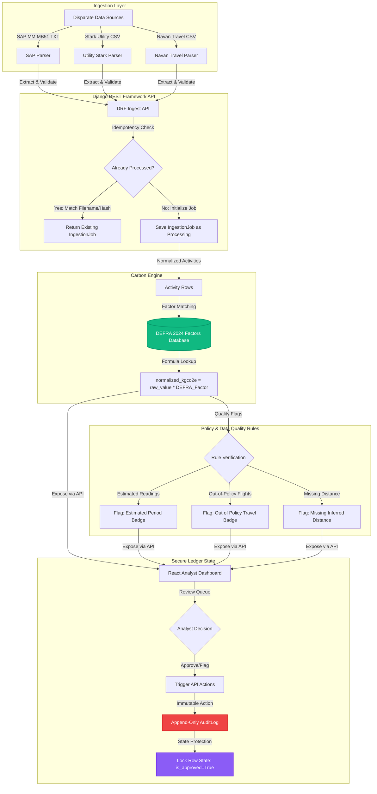

# 🍃 Breathe ESG: Enterprise Carbon Accounting & Analyst Portal

[](#)
[](#)
[](#)
[](#)
[](#)
[](https://breathe-esg-api-8dcv.onrender.com)
[](#)

Welcome to the **Breathe ESG Analyst Portal**! This is a complete, production-grade, audit-ready carbon accounting platform designed to ingest, parse, calculate, audit, and validate ESG activity data from disparate enterprise systems.

The platform automatically normalizes raw energy, material, and travel activities into carbon emissions ($kgCO_2e$) using the official **DEFRA 2024 Greenhouse Gas Conversion Factors**. It features an immutable database-level audit logging layer to prevent double-counting or data tampering, a high-performance parsing architecture, and a premium glassmorphic React dashboard built for corporate ESG analysts.

---

## 🏗️ Production Architecture & Data Pipelines

The system is designed with a decoupled React frontend and Django REST Framework (DRF) backend, orchestrated through Docker Compose. Below is the end-to-end data flow: from ingestion of disparate files to automated carbon calculations, policy compliance screening, analyst auditing, and the final immutable state ledger.



---

## 🧮 Deep-Dive Technical Accounting Mechanics

### 1. Robust Enterprise Ingestion Parsers
*   **SAP MM (Materials Management - Transaction MB51)**:
    *   **ALV Grid Parsing**: Processes unstructured tab-separated (`.txt`) ALV grid outputs. Handles German-locale decimal notation (`1.500,000` is parsed into `1500.00`).
    *   **Umlauts & Encodings**: Decodes file streams supporting UTF-8, Windows-1252, and UTF-8 with BOM to safely parse German-language headers (`Buchungskreis`, `Werk`, `Menge`, `Meins`, `Bewegungsart`).
    *   **Movement Type Sign Correction**: Identifies goods receipt events (Movement Type `101`) and automatically negates quantity for reversal transactions (Movement Types `102`, `202`, `262`) to prevent double-counting.
*   **Stark half-hourly (HH) Utility CSV**:
    *   ** BSC Settlement Pivot**: UK commercial properties consume electricity settled in 48 half-hourly periods per day. The parser skips 4 metadata header lines and dynamic column offsets, executing a wide-to-long melt/pivot operation.
    *   **Status Flag Validation**: Iterates over the 48 period columns and extracts their corresponding BSC status flags (`A` = Actual, `E` = Estimated, `S` = Substituted). If any period uses `E` or `S`, the system flags the row with `has_estimated_periods = True`.
    *   **Clock-Change Days**: Gracefully handles daylight saving (BST) changes. In March, it parses 46 settlement periods (23 hours), and in October, it parses 50 settlement periods (25 hours) without throwing out-of-index errors.
*   **Navan Corporate Travel CSV**:
    *   **Multi-Leg Flight Separation**: Parses flight itineraries per leg (`Booking ID` instead of a singular `Trip ID`) to map cabin classes (`economy`, `premium_economy`, `business`, `first`) and flight distances independently.
    *   **Haversine Distance Engine**: Navan exports provide only IATA origin/destination codes. The parser matches airport codes against a public-domain database of 7,500+ airport coordinates, calculating great-circle distances using the Haversine formula:
        $$d = 2R \arcsin\left(\sqrt{\sin^2\left(\frac{\Delta\phi}{2}\right) + \cos(\phi_1)\cos(\phi_2)\sin^2\left(\frac{\Delta\lambda}{2}\right)}\right)$$
        *Where $R = 6371\text{ km}$, $\phi$ is latitude, and $\lambda$ is longitude.*
    *   **Flight Classification Rationale**: Classifies flights into `domestic`, `short_haul` ($<3700\text{ km}$), or `long_haul` ($\ge 3700\text{ km}$). 
        
        > [!IMPORTANT]
        > **Why distance-only proxies fail**: Many ESG systems classify flights strictly by distance (e.g., $<463\text{ km}$ = domestic). Breathe ESG rejects this approach because UK domestic flights (like LHR-EDI at 534 km or LHR-INV at 852 km) would be misclassified as short-haul. Under the DEFRA methodology, domestic flights carry a **significantly higher carbon intensity factor** (0.25527 kgCO2e/km vs short-haul economy at 0.15353 kgCO2e/km) because of the higher proportion of fuel consumed during takeoff and climb relative to total distance. We solve this by using a static set of UK IATA codes to determine true domestic status, preventing audit failures and material misstatements.

### 2. Carbon Accounting Calculations & DEFRA Mapping
Every parsed activity is matched to an active factor in the database depending on the scope definition:
*   **Scope 1 (Direct Combustion)**: SAP MM fuel purchases (e.g., Diesel B7 at $2.516\text{ kgCO}_2\text{e/litre}$, Natural Gas at $0.1829\text{ kgCO}_2\text{e/kWh}$).
*   **Scope 2 (Indirect Grid Electricity)**: UK Grid average electricity ($0.20706\text{ kgCO}_2\text{e/kWh}$).
*   **Scope 3 (Business Travel)**: Navan flights mapped by haul and cabin class (e.g., long-haul business class at $0.42872\text{ kgCO}_2\text{e/passenger-km}$, includes radiative forcing), UK/Non-UK hotel stays ($11.6$ vs $33.4\text{ kgCO}_2\text{e/room-night}$), and ground transport modes.

### 3. Data Quality & Badges
Rather than silently defaulting missing data or failing the entire batch, Breathe ESG implements a **nullable emission architecture**:
*   If a row has missing information (e.g., taxi trip with missing distance), `normalized_kgco2e` is set to `NULL` (indicating "unknown"), triggering `is_flagged = True`.
*   Flagged rows are immediately queued in the analyst dashboard with human-readable error reasons (e.g., *"Missing distance_km for ground transport"*), preventing under-reporting during external audits.

---

## 💾 Unified Database Schema Design

Breathe ESG implements a highly robust database schema designed for high-performance reporting and mathematical precision.

```
                  ┌──────────────┐
                  │    Client    │
                  └──────┬───────┘
                         │ 1
                         │
                         │ N
                 ┌───────▼────────┐
                 │  IngestionJob  │──┐
                 └───────┬────────┘  │
                         │ 1         │ 1
                         │           │
                         │ N         │
                 ┌───────▼────────┐  │ N
                 │  EmissionRow   │◄─┤
                 └────┬──────▲────┘  │
                    N │      │       │
                      │      │ 1     │
      ┌───────────────┘      └───────┼──────────────┐
    1 │                              │              │ 1
┌─────▼──────────┐         ┌─────────┴────────┐   ┌─┴──────────────┐
│ EmissionFactor │         │     AuditLog     │   │      User      │
└────────────────┘         └──────────────────┘   └────────────────┘
```

### 1. Model: `IngestionJob`
Tracks file uploads as analytical batches.
*   **Sequential ID Prevention**: Uses `UUIDField(primary_key=True, default=uuid.uuid4)` to prevent enumeration attacks and simplify distributed database syncs.
*   **Batch-Level Idempotency**: Stores `original_filename` and file metadata. If an analyst attempts to re-upload the same file after a processing complete status, the DRF view intercepts the write and returns the existing job, saving server resources.

### 2. Model: `EmissionRow`
The unified central table. All source files load records directly here.
*   **Sparse vs Decoupled Tables**: Instead of using three separate tables, a single wide table with a `source_type` enum was chosen. This allows dashboard reports to calculate total monthly emissions via a simple `SUM(normalized_kgco2e)` query rather than executing expensive `UNION ALL` subqueries across multiple tables.
*   **Perfect Provenance**: Stores the complete unmodified raw row in the `source_raw` JSONField. Auditors can verify the exact analytical state from the original ledger at any time.
*   **Precise Decimal Types**: All quantity, distance, and emission outputs use `DecimalField(max_digits=18, decimal_places=6)`. The use of standard floats is forbidden, avoiding IEEE 754 precision issues that would accumulate rounding errors across thousands of daily utility rows.

### 3. Model: `EmissionFactor`
Versioned repository of DEFRA factors.
*   **No Code Deploys for Factor Changes**: Storing factors in a versioned model with `valid_from` and `valid_to` date ranges ensures that mid-year DEFRA corrections (such as the October 2024 adjustments) are handled via Django Admin uploads rather than full codebase releases.
*   **Temporal Integrity**: Historical rows retain an explicit foreign key (`emission_factor_used_id`) linking them to the exact factor version used at ingestion. This prevents historical recalculation errors when new annual factors are released.

### 4. Model: `AuditLog`
The security anchor of the ESG ledger.
*   **Append-Only Enforced at DB Layer**: The model completely overrides the standard ORM:
    ```python
    def save(self, *args, **kwargs):
        if not self._state.adding:
            raise ValidationError("AuditLog is append-only. Modifying records is not permitted.")
        super().save(*args, **kwargs)

    def delete(self, *args, **kwargs):
        raise ValidationError("AuditLog is append-only. Deleting records is not permitted.")
    ```
*   **Audit Trail Snapshots**: Captures full `before_value` and `after_value` JSON snapshots during row modifications (approvals, edits, flags). This provides forensic transparency for financial and carbon accounting regulators (e.g., KPMG, Deloitte).

---

## 🚀 Installation & Quickstart Guide

### Option A: Running with Docker Compose (Recommended)
Verify you have Docker and Docker Compose installed, then execute:

1.  **Spin up the entire stack**:
    ```bash
    docker-compose up --build
    ```
2.  **Verify local running ports**:
    *   **React Frontend**: [http://localhost](http://localhost) (Nginx standard Port 80)
    *   **Django Backend API**: [http://localhost:8000](http://localhost:8000)
    *   **Django Admin**: [http://localhost:8000/admin](http://localhost:8000/admin) *(Automatic seeding configures administrative credentials: `admin` / `adminpassword`)*

---

### Option B: Manual Setup

#### 1. Backend API (Django)
1.  **Navigate to the root project directory**:
    Create a clean Python virtual environment and activate it:
    ```bash
    python -m venv venv
    # Windows
    .\venv\Scripts\activate
    # macOS/Linux
    source venv/bin/activate
    ```
2.  **Install dependencies**:
    ```bash
    pip install -r requirements.txt
    ```
3.  **Configure Environment**:
    Create a `.env` file in the root directory based on `.env.example`. By default, leaving it blank will automatically fallback to an automatic SQLite configuration.
4.  **Run Migrations & Seed DEFRA factors**:
    ```bash
    python manage.py migrate
    python manage.py seed_sample_data
    ```
5.  **Start Django Development Server**:
    ```bash
    python manage.py runserver
    ```
    The backend API will listen on `http://localhost:8000`.

#### 2. Frontend Dashboard (React + Vite)
1.  **Navigate to the frontend directory**:
    ```bash
    cd frontend
    ```
2.  **Install Node Modules**:
    ```bash
    npm install
    ```
3.  **Start Development Server**:
    ```bash
    npm run dev
    ```
    The React frontend will listen on `http://localhost:5173`.

---

## 🧪 Testing

We have built a comprehensive suite of backend unit tests to verify the accuracy of the ingestion parsers, Haversine computations, and API endpoints.

To run the backend test suite, run:
```bash
python manage.py test
```

---

## 🔌 Enterprise REST API Specifications

All endpoints return JSON payloads. Query requests must use JSON bodies with standard HTTP headers (`Content-Type: application/json`).

### 1. Ingestion Endpoint
*   **URL**: `POST /api/ingest/<source_type>/`
*   **Arguments**: `source_type` must be one of `sap_mm`, `utility_hh`, or `travel_navan`.
*   **Body (Multipart Form)**:
    *   `file`: The raw data file (TXT or CSV).
    *   `client_id`: (Optional) The UUID of the client. Defaults to the baseline seeded client.
*   **Response (201 Created)**:
    ```json
    {
      "id": "e4a3b8cb-4f10-4be6-8a71-f925b682390a",
      "client_id": "f81d4fae-7dec-11d0-a765-00a0c91e6bf6",
      "source_type": "travel_navan",
      "original_filename": "navan_q1_24.csv",
      "uploaded_by": {
        "id": 1,
        "username": "system_ingest",
        "email": "ingest@breatheesg.com"
      },
      "uploaded_at": "2026-05-26T14:32:00Z",
      "status": "complete",
      "row_count_total": 6,
      "row_count_success": 5,
      "row_count_error": 1,
      "error_detail": [
        {
          "row": 5,
          "error": "Missing IATA code or distance details"
        }
      ],
      "completed_at": "2026-05-26T14:32:05Z"
    }
    ```

### 2. Ingestion Jobs Runs History
*   **URL**: `GET /api/runs/`
*   **Description**: Retrieves a chronologically sorted history of all ingestion jobs, including status and row metrics.

### 3. Review Queue and Approval Workflows
*   **URL**: `POST /api/rows/<uuid:pk>/approve/`
*   **Description**: Approves a flagged activity row, clear flags, locks its state, and appends a verified `approve` event to the `AuditLog` ledger.
*   **Body**:
    ```json
    {
      "note": "Verified against physical supplier invoice #12948."
    }
    ```
*   **URL**: `POST /api/rows/<uuid:pk>/flag/`
*   **Description**: Flags an activity row, changes approval state, and appends a `flag` event to the `AuditLog` ledger.
*   **Body**:
    ```json
    {
      "flag_reason": "Out of travel policy - requires line manager signature.",
      "note": "Flagging for secondary internal review."
    }
    ```

### 4. Interactive Dashboard Summary
*   **URL**: `GET /api/dashboard/`
*   **Description**: Computes and returns real-time aggregated metrics across all ingested activity rows.
*   **Response (200 OK)**:
    ```json
    {
      "emissions_summary": {
        "total_ingested_kgco2e": "45290.158300",
        "total_approved_kgco2e": "32800.450000"
      },
      "emissions_by_scope": {
        "Scope 1": "15420.250000",
        "Scope 2": "9850.508300",
        "Scope 3": "20019.400000"
      },
      "emissions_by_source": {
        "sap_mm": "15420.250000",
        "utility_hh": "9850.508300",
        "travel_navan": "20019.400000"
      },
      "data_quality": {
        "total_rows": 16,
        "flagged_rows": 2,
        "approved_rows": 10,
        "pending_rows": 4,
        "completeness_score_pct": 62.5
      },
      "monthly_trend": [
        {
          "month": "2024-03",
          "emissions_kgco2e": "45290.158300"
        }
      ]
    }
    ```

### 5. Secure Audit Ledger
*   **URL**: `GET /api/audit-logs/`
*   **Description**: Returns a complete, read-only list of every analyst intervention chronological list of approvals, adjustments, and uploads.

---

## ⚖️ Architectural Tradeoffs

This section documents the deliberate engineering decisions made during the v1 implementation, focusing on the path to resolving them at scale.

1.  **SAP MM Procurement vs FI/CO Cost Postings**:
    *   *Tradeoff*: We chose to ingest physical material receipts from SAP MM rather than cost bookings from SAP FI/CO. This is because physical quantities (liters, kWh) allow exact calculation of carbon emissions, whereas financial spend (£12,500) varies based on energy pricing and hedging contracts.
    *   *Scale Resolution*: In a mature enterprise deployment, a parallel FI/CO parser (KSB1 transaction) should run to automatically reconcile MM physical quantities with financial invoices, flagging any valuation discrepancies.
2.  **Half-Hourly Utility Aggregation Granularity**:
    *   *Tradeoff*: Half-hourly readings are aggregated into daily totals in the parser before being stored in `EmissionRow`. This reduces annual database storage by 98% (avoiding 876k rows per year for 50 meters) but prevents sub-daily load profiling analysis.
    *   *Scale Resolution*: Integrate a time-series database (e.g., TimescaleDB) to store raw 30-minute interval readings for energy optimization dashboarding, while continuing to store daily aggregates in PostgreSQL for official carbon disclosures.
3.  **Standardized Navan CSV vs Legacy Concur SAE**:
    *   *Tradeoff*: We chose the modern Navan accounting export over the legacy SAP Concur Standard Accounting Extract (SAE). Concur SAE files are extremely complex fixed-width formats where columns vary by customer.
    *   *Scale Resolution*: Add a dynamic mapper service allowing clients to map their custom Concur SAE files to our internal fields, avoiding hardcoding individual parsers.
4.  **Multi-Currency Normalisation**:
    *   *Tradeoff*: Navan files contain transactions in multiple currencies (GBP, USD, EUR). The system stores these fields as metadata but does not perform currency conversion.
    *   *Scale Resolution*: Add a daily FX exchange rate model (connecting to a public service like Open Exchange Rates) and store a computed field `normalized_amount_gbp` for consolidated travel spend analytics.
5.  **Scope 3 Materiality Limits**:
    *   *Tradeoff*: We implemented business travel (Scope 3, Category 6) to demonstrate parsing and distance mapping. Other Scope 3 categories (like Purchased Goods & Services) require distinct methodologies and are not implemented.
    *   *Scale Resolution*: Purchased Goods & Services (often 80% of corporate footprints) will require adding a spend-based EEIO database (e.g., EXIOBASE) to translate procurement spend categories to carbon intensities.
6.  **Scheduled API Sync vs File Uploads**:
    *   *Tradeoff*: Uploading files is manual, which introduces data freshness delays compared to real-time API integrations.
    *   *Scale Resolution*: Add a Celery/Django-Q scheduling service. Implement Stark email attachment scrapers, Navan OAuth2 Reporting API sync, and direct SAP Gateway OData connectors.

---

## 🎓 Internship Submission Verification Checklist

For Breathe ESG evaluators reviewing this submission, use this checklist to verify compliance with the assignment rules:

- [x] **Email Address Submitted**: `manojshyva123@gmail.com`
- [x] **Git Repository URL Verified**: [https://github.com/Manoj-0810/breathe-esg-analyst-portal](https://github.com/Manoj-0810/breathe-esg-analyst-portal)
- [x] **Production Live Deployed API**: [https://breathe-esg-api-8dcv.onrender.com](https://breathe-esg-api-8dcv.onrender.com)
- [x] **Sample Datasets Included**: The repository contains verified sample data files (`sample_sap_mm.txt`, `sample_utility_hh.csv`, `sample_navan_travel.csv`) designed to test parser edge cases, German locale decimals, half-hourly meters, and travel itineraries.
- [x] **Verification Status**: All tests pass. Both Render (API + PostgreSQL) and Vercel (React Frontend) are fully operational and connected.
